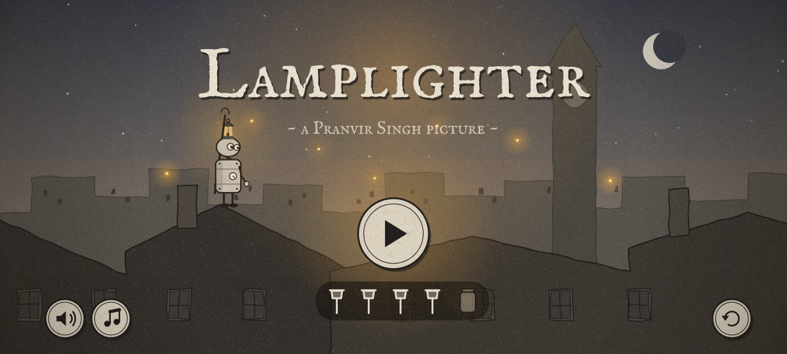
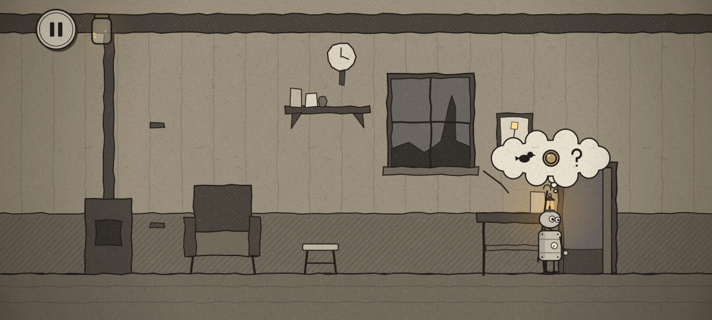
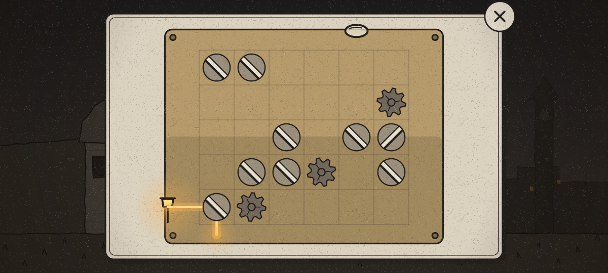

<p align="center">
  
</p>

<h1 align="center">Lamplighter</h1>

<p align="center">
  <b>A wordless point-and-click adventure for Android.</b><br>
  Guide Wick, a little tin lamplighter, through a town gone dark, and light it up again lamp by lamp.
</p>

<p align="center">
  <a href="https://github.com/pranvirsingh/Lamplighter/releases/latest"></a>
  <a href="https://github.com/pranvirsingh/Lamplighter/actions/workflows/ci.yml"></a>
  
  
  <a href="LICENSE"></a>
</p>

<p align="center">
  
  
</p>
<p align="center">
  
  
</p>

## About

Lamplighter is written in Kotlin with **no game engine and no third-party libraries**. Every scene is drawn in code in a sepia and charcoal hand, where amber lamplight is the only colour in the world, and all music and sound are synthesised on the device. Apart from the title, there are no words to read: the story, the hints and the puzzles are told in pictures. The whole game is a ~410 KB APK, plays in landscape, and needs **no permissions**.

## The story

The lamps have gone out across town. Wick wakes up in his workshop with a flame in his head-lantern and sets out to light them again, one district at a time:

| Scene | What happens |
|---|---|
| Workshop | Wick wakes up and finds his way out |
| Market | Trade with a crow and get the gas flowing again |
| Canal | Help a hungry cat and get the bridge working |
| Hill | Line up a beam of light, and look through the telescope |
| Square | Open the way to the clock tower |
| Tower Top | Start the old clock and bring the light home |

Four lamps to light, items to find and use, townsfolk and critters to help, and four machine puzzles that open on close-up cards:

- a **pressure valve** in the market
- a **gear train** at the canal
- **mirrors and a light beam** on the hill
- **glyph rings** at the top of the tower

The hill also has a **telescope**: look through it for a clue you'll need later.

## How to play

- **Tap** anywhere to walk there, and tap things to use or pick them up.
- **Pick an item** from your inventory, then tap where you want to use it.
- **Tap Wick** whenever you're stuck: he thinks a little picture of what to try next.
- **Catch fireflies** as you go; they fly into the jar in the corner.
- Sound and music can each be switched off, and progress is saved on the device.

## Download

1. Open the [latest release](https://github.com/pranvirsingh/Lamplighter/releases/latest) and download the `.apk`.
2. Open it on your phone. Android will ask you to allow installing apps from that source the first time.
3. Requires Android 7.0 (API 24) or newer.

## Build from source

`build.sh` produces `build/Lamplighter.apk`. It needs:

- `aapt2`, `apksigner` and `d8.jar` (R8) from Android build-tools, plus `android.jar` for API 34
- the Kotlin compiler and standard library
- a JDK (for `java`, `jar` and `keytool`) and Python 3

The scripts expect the project at `/home/claude/lamplighter` and the toolchain in `/home/claude/tc` under specific jar names. Those paths are hardcoded in `build.sh`, `kc.sh`, `t.sh` and in the tests, and `PlayRunner` and `Monkey` also load the font from the toolchain folder. The easiest way to build is to recreate that layout, which is what [`.github/workflows/ci.yml`](.github/workflows/ci.yml) does on Ubuntu (build-tools 34, Kotlin 2.3.10, JDK 17) before running the scripts unchanged. On first run, `build.sh` creates a local signing key, so a locally built APK is for testing. It can't update an installed release build.

## Tests

The tests run on a plain JVM against a small Java2D shim of `android.graphics`. `PlayRunner` must run before `MonkeyKt`, because it writes the saved games Monkey restarts from:

```
mkdir -p shots      # PlayRunner and AudioTest write their output here
./t.sh AudioTest PlayRunner MonkeyKt
```

- **AudioTest:** checks that every sound effect, ambient sound and music stem is audible, along with the full and dark music mixes.
- **PlayRunner:** plays the whole game from the title to the ending through the real input, solving every puzzle and catching every firefly, with checks at each step (story flags, items, puzzle state, saved progress) and a screenshot of every moment to `shots/` (the screenshots above come from here). It also saves 8 snapshots of the game in progress.
- **MonkeyKt:** random taps for 8 rounds of 40,000 frames from a fresh game, then again from each of PlayRunner's snapshots, with process-death restores. It checks that the story always stays consistent (a lamp is never lit before what it needs is in place: the gas on, the bridge down, the lens set, the clock running; used items leave the inventory; no item is held twice), that Wick stays in bounds, and that the game never gets stuck.
- **IconGen** regenerates the launcher icons in `res/`. It isn't run in CI because it rewrites game resources.

## Project layout

| Path | What it is |
|---|---|
| `src/com/pranvir/lamplighter/Game.kt` | Story flags, inventory, hints, input, screens and saves |
| `src/com/pranvir/lamplighter/Scenes.kt` | The six scenes, their hotspots and the title and ending art |
| `src/com/pranvir/lamplighter/Minis.kt` | The close-up machine puzzles |
| `src/com/pranvir/lamplighter/Chars.kt` | Wick, the townsfolk and the critters |
| `src/com/pranvir/lamplighter/Core.kt` | The palette, the drawing toolkit and shared helpers |
| `src/com/pranvir/lamplighter/Synth.kt`, `Audio.kt` | Synthesised music and sound effects, and playback |
| `src/com/pranvir/lamplighter/MainActivity.kt` | Android entry point: view, input, haptics, storage |
| `jvmtest/` | JVM tests and the `android.graphics` shim |
| `build.sh`, `kc.sh`, `t.sh`, `zipalign.py`, `rules.pro` | Build and test scripts: resources, Kotlin compile, R8, packaging, signing |

See [CHANGELOG.md](CHANGELOG.md) for release history.

## License

Code: [MIT](LICENSE) © 2026 Pranvir Singh.

Font: **IM FELL English SC** (`assets/fonts/fell.ttf`) © Igino Marini (2007 in the font file, 2010 in the published license), licensed under the [SIL Open Font License 1.1](docs/licenses/OFL-IMFellEnglishSC.txt).
